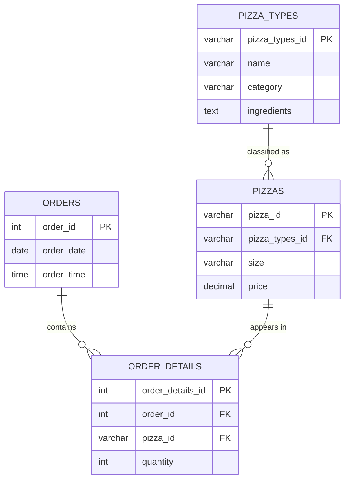

# 🍕 Pizza Sales Data Analysis (SQL Portfolio Project)

This project analyzes **pizza sales data using SQL** to answer key business questions such as **revenue trends, the most popular pizza, and customer buying behavior**.

---

## 📂 Database Structure
The database consists of four tables:

- **Orders**: contains order date and time  
- **Order Details**: contains quantity  
- **Pizzas**: contains size and price  
- **Pizza Types**: contains category and ingredients
### 📊 Entity Relationship Diagram (ERD)

---

## 🎯 Objectives
- Practice SQL skills using a realistic dataset  
- Explore sales performance, product popularity, and revenue insights  
- Demonstrate ability to write efficient queries using **joins, aggregations, and window functions**  

---

## 🛠️ Skills Demonstrated
- **Joins**: `INNER JOIN`, `LEFT JOIN` across multiple tables  
- **Aggregations**: `SUM`, `COUNT`, `AVG`, `GROUP BY`  
- **Date & Time Functions**: sales by day, month, hour  
- **Window Functions**: `RANK`, `ROW_NUMBER` for top-selling pizzas  
- **Subqueries & CTEs**: modular and reusable queries  

---

## 📊 Example Business Questions Answered
- What is the **total revenue** generated over time?  
- Which **pizza type** is the most popular?  
- What are the **peak sales hours** in a day?  
- Which **pizza size** contributes most to revenue?  
- What is the **monthly revenue trend**?

---

## 🚀 How to Use
1. Clone this repository  
2. Run the `export_database.sql` under the `/schemas` into the MySQL database 
3. Run the provided SQL script in `/queries` to reproduce the analysis  

---

## 📌 Next Steps
- Visualize results using **Power BI or Tableau**  
- Automate queries for reporting

---

👩‍💻 *This project is part of my SQL portfolio to showcase analytical and problem-solving skills.*
